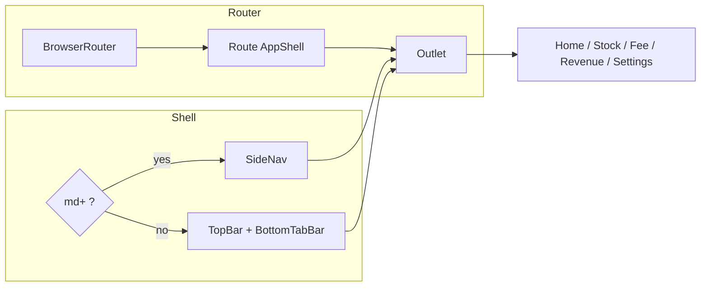
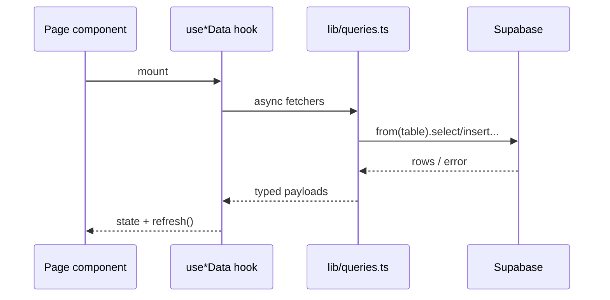

# Architecture — Shop FF

This document describes how the Shop FF codebase is structured, how runtime pieces connect, and where business rules live. For product intent and formulas, see [scope.md](./scope.md).

---

## Summary

Shop FF is a **single-page application (SPA)** built with **React 19** and **Vite**. It loads data from **Supabase (Postgres + Row Level Security)** through a thin **query layer**, with **screens** composing **hooks** and **presentational UI**. The shell adapts navigation for **mobile (bottom tabs + top bar)** vs **tablet/desktop (sidebar)**.

---

## Technology Stack

| Layer | Choice |
|--------|--------|
| Runtime | React 19, React DOM 19 |
| Bundler / dev server | Vite 8 |
| Language | TypeScript (~6.x) |
| Routing | react-router-dom 7 (`BrowserRouter`, nested routes, `Outlet`) |
| Styling | Tailwind CSS 4 (`@tailwindcss/vite`, `@import "tailwindcss"` in `src/index.css`) |
| Backend-as-data | `@supabase/supabase-js` with generated-style types in `src/types/database.types.ts` |
| Tables / data grids | `@tanstack/react-table` wrapped by `src/components/ui/data-table.tsx` |
| UI primitives | Radix primitives (e.g. alert dialog), lucide-react icons, `class-variance-authority`, `clsx`, `tailwind-merge` |
| React Compiler | `@rolldown/plugin-babel` + `babel-plugin-react-compiler` alongside `@vitejs/plugin-react` |

**Path alias:** `@/` → `./src/` (configured in `vite.config.ts`).

---

## Repository Layout

```
├── docs/                  # Product & architecture docs (this file, scope.md)
├── public/                # Static assets served as-is
├── src/
│   ├── main.tsx           # Entry: theme bootstrap, mounts <App />
│   ├── App.tsx            # Router + route definitions
│   ├── index.css          # Tailwind + design tokens (CSS variables, dark variant)
│   ├── assets/
│   ├── components/
│   │   ├── dashboard/     # Dashboard-specific widgets (e.g. MetricCard)
│   │   ├── layout/        # AppShell, SideNav, TopBar, BottomTabBar
│   │   └── ui/            # Reusable primitives (button, card, table, …)
│   ├── hooks/             # Feature hooks orchestrating queries + UI state
│   ├── lib/               # Supabase client, queries, theme, utilities
│   ├── pages/             # Route-level screens (+ subfolders e.g. stock/columns.tsx)
│   ├── types/             # Shared TS types aligned with DB tables
│   └── docs/              # Embedded dev notes (e.g. schema details referenced from scope.md)
├── index.html             # SPA shell, loads /src/main.tsx
├── vite.config.ts
├── package.json
└── .env.example           # Expected VITE_* variables
```

The root `@/` folder duplicates some UI paths for tooling or legacy layout; **`src/` is the canonical application source** resolved by Vite’s `@` alias.

---

## Application Bootstrap

1. **`index.html`** provides `#root` and loads `src/main.tsx`.
2. **`main.tsx`** calls `applyTheme()` from `lib/theme.ts` (reads `localStorage`, toggles `.dark` on `<html>`) before rendering.
3. **`App.tsx`** wraps the tree in **`BrowserRouter`** and registers routes under **`AppShell`**.

---

## Routing & Navigation

Routes are declared in `App.tsx`:

| Path | Screen | Primary data |
|------|--------|----------------|
| `/` (`index`) | `HomePage` | Dashboard aggregates |
| `/stock` | `StockPage` | Inventory rows |
| `/fee` | `FeePage` | *(currently in-memory mock list; not wired to Supabase)* |
| `/revenue` | `RevenuePage` | Weekly snapshots + rolling period |
| `/settings` | `SettingsPage` | Local preferences only |

**`AppShell`** (`components/layout/AppShell.tsx`) renders an **`Outlet`** for child routes:

- **`useMediaQuery('(min-width: 768px)')`**: at `md` and up, **`SideNav`** + constrained main column; below `md`, **`TopBar`** + scrollable **`main`** + **`BottomTabBar`**.
- Mobile/tab bar and sidebar link sets both expose **Home, Stock, Fee, Settings** only; **`/revenue`** is reached from dashboard actions (`HomePage` navigates programmatically).



---

## Data & Backend Integration

### Supabase client

- **`lib/supabase.ts`** creates `createClient<Database>()` using **`VITE_SUPABASE_URL`** and **`VITE_SUPABASE_ANON_KEY`**. Missing env vars fail fast at startup.
- **`src/types/database.types.ts`** defines `Database` plus row/insert/update types for **`inventory`**, **`repairs`**, **`sales`**, **`weekly_snapshots`**.

### Table naming

- **`lib/table-names.ts`** builds logical names from a suffix: **`VITE_TABLE_SUFFIX`** (e.g. `_dev` in `.env.example`). This avoids dev/prod table collisions without code forks.

### Query layer

**`lib/queries.ts`** is the **single hub** for Supabase access used by hooks:

- Aggregations: **`fetchPeriodMetrics`**, **`fetchStockValue`**, **`fetchLatestWatermark`**, etc.
- List/detail helpers: **`fetchAllInventory`**, **`fetchRecentRepairs`**, **`fetchLowStockItems`**, **`fetchMonthSnapshots`**
- Mutations affecting reporting: **`closeWeek`** inserts into **`weekly_snapshots`**.

Many functions treat Postgres error **`42P01`** (undefined table) as “empty”: the UI degrades gracefully while migrations roll out.

### Hooks (React state orchestration)

| Hook | Role |
|------|------|
| `useDashboardData` | Parallel fetch: watermark → period metrics since watermark, stock value, recent repairs, low-stock lists/counts |
| `useStockData` | Loads full inventory via `fetchAllInventory` |
| `useRevenueData` | Month snapshots + live “current period” since last watermark; **`closeCurrentWeek`** persists snapshot then reloads |

**Pattern:** Hooks own **loading/error/refresh** UI contract; **`lib/queries.ts`** stays free of React.



Security note: **all reads/writes use the browser anon key**. Correctness and tenant isolation depend on **Supabase RLS policies** and Postgres permissions (not enforced in this repo’s TypeScript).

---

## Domain Logic (high level)

- **Period revenue**: Labor fees plus sales (**`qty` × `unit_price`**); **COGS** from **`qty` × `unit_cost`** on sales; **`grossProfit`** aligns with **`repairFees + (partsRevenue − cogs)`** (see scope for naming).
- **Rolling window**: **`weekly_snapshots.period_end`** (latest row) acts as a **watermark**; **`fetchPeriodMetrics(since)`** only counts repairs/sales **`created_at` after `since`**.
- **Week close**: **`closeWeek`** snapshots current aggregates into **`weekly_snapshots`**, advancing the effective window for subsequent live metrics.

---

## UI Composition

- **Pages** (`src/pages/*`) assemble layout sections, **`Card`/`Button`/`Badge`/`Skeleton`** from **`components/ui`**, and feature hooks.
- **Dashboard**: **`MetricCard`** and **`formatPKR`** from **`lib/utils.ts`** for consistent formatting.
- **Stock**: **`stock/columns.tsx`** defines TanStack columns; **`DataTable`** applies filters driven by **`useSearchParams`** (e.g. `?filter=low` triggers low-stock filter).

### Theming & preferences

- **Theme**: `localStorage.theme` (`light` | `dark` | `system`); **`applyTheme`** syncs **`document.documentElement.classList`**.
- **Other settings**: currency string and numeric low-stock threshold persisted in **`localStorage`**; dashboard low-stock thresholds in **`useDashboardData`** are currently **coded (e.g. 2)** independently—worth aligning when wiring settings through.

---

## Build & Quality

| Script | Purpose |
|--------|---------|
| `npm run dev` | Vite dev server |
| `npm run build` | `tsc -b` then `vite build` |
| `npm run lint` | ESLint |
| `npm run preview` | Serve production bundle locally |

React Compiler is integrated at build time via Babel; treat component purity and hook rules as stricter-than-default.

---

## Environment Configuration

See **`.env.example`**:

- **`VITE_SUPABASE_URL`**, **`VITE_SUPABASE_ANON_KEY`** — required.
- **`VITE_TABLE_SUFFIX`** — optional appended suffix for table names (`_dev` vs production empty string).

Copy to `.env` for local development (values are never committed).

---

## Current Gaps / Evolving Areas

These are intentional call-outs for architects and reviewers:

1. **`FeePage`** uses **hard-coded mock repairs**; dashboard and **`lib/queries.ts`** already expect real **`repairs`** rows—the fee UI is the piece to connect.
2. **Stock “Add Part”** and other write flows may be UI placeholders until mutations are added to **`queries.ts`** (or inline `supabase` usage is standardized—today reads/writes funnel through **`queries.ts`** except future additions).
3. **Revenue navigation** exists only outside the primary nav; acceptable for v1 but affects discoverability.

---

## Related Documentation

- [scope.md](./scope.md) — business scope, metrics, schema narrative.
- [src/docs/db.md](../src/docs/db.md) — database details linked from scope.
